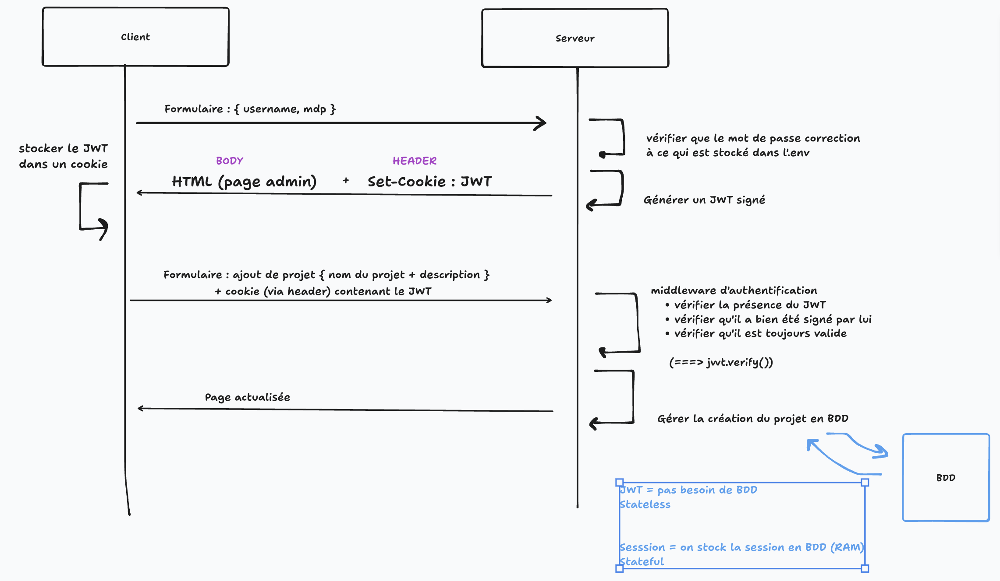

# Espace administrateur - Design Review

Contexte : 
- Admettons qu'on ait une application Node, avec rendu côté serveur. 
- Un seul administrateur (Jeff)

Reflexion : 
- un seul administrateur ? --> besoin de le stocker en BDD ? 
  - non pas forcement : mettre une clef de déchiffrement dans un .env

