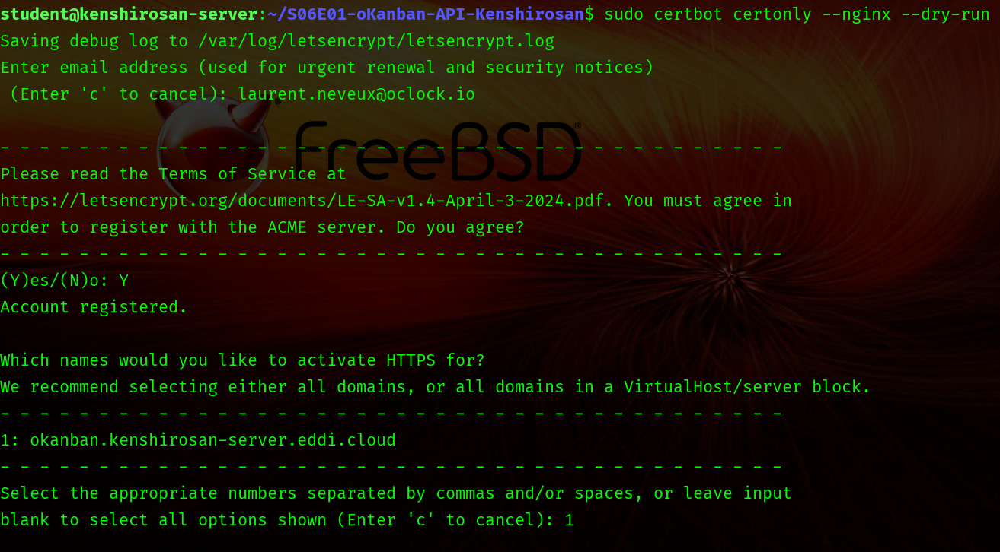
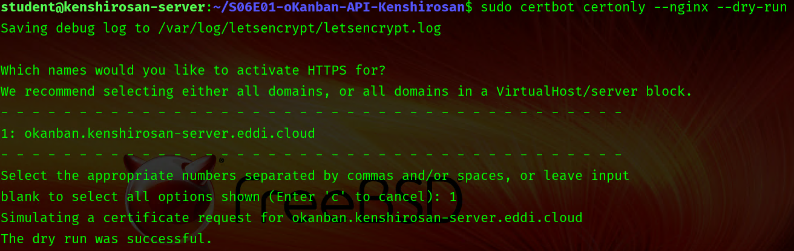
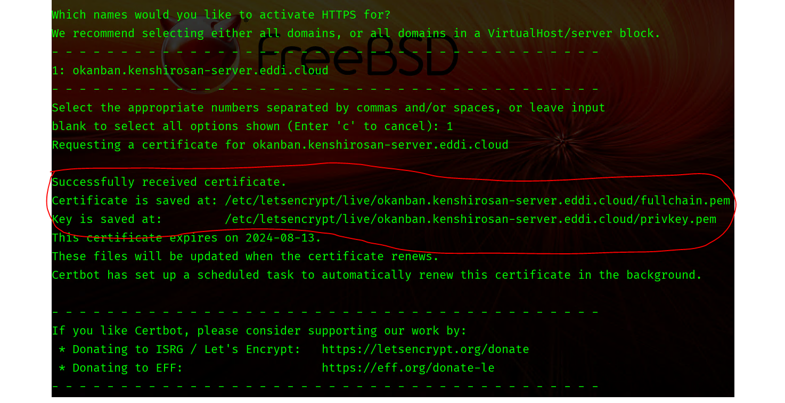
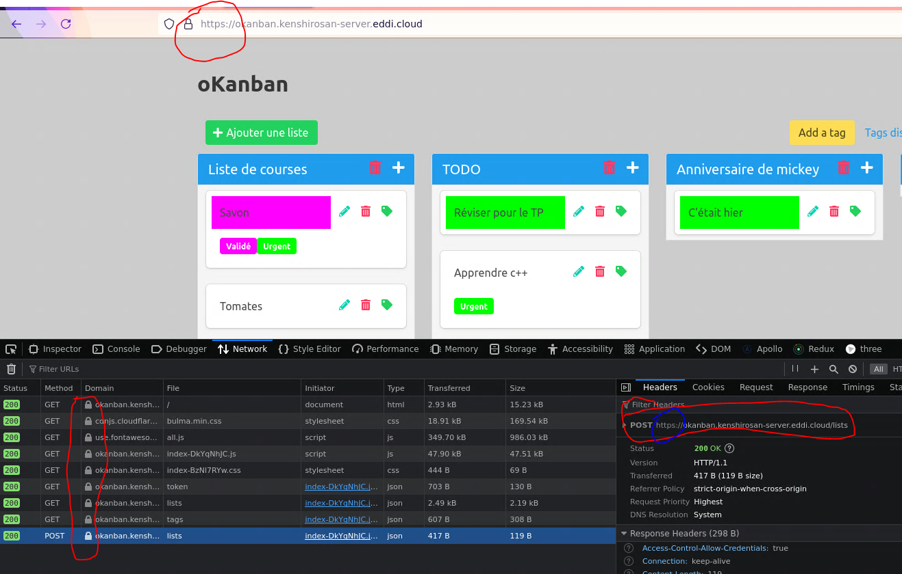

# Challenge SC02E02 - Certificat SSL pour HTTPS

⚠️ Challenge exploratoire (peu guidé)

Gérer des certificats SSL avec un service Docker, c'est un peu galère... Alors on propose une solution à la mano, mais qui a le mérite d'être plus abordable.

Pré-requis :
- S'assurer que notre app tourne sur :
  - (CLIENT) `http://oquiz.PSEUDO-server.eddi.cloud`
  - (API) `http://oquiz-api.PSEUDO-server.eddi.cloud`
- S'assurer que le VPS est "publique" via le dashboard d'administration de la VM sur Kourou (sans quoi il ne sera pas possible de générer les certificats)

A faire :
- Se connecter en SSH au VPS
- Installer Certbot sur le VPS (à défaut d'avoir un service pour ça).
- Générer un certicat SSL (les deux fichiers `.pem`) à l'aide de `certbot`
- Les "monter" (volume) dans le conteneur `proxy` afin que celui-ci puisse les lire
- En local : les rajouter à la config `proxy/nginx.conf` (`ssl_certificate` et `ssl_certificate_key`)
  - Sauvegarder la config, push le code, puis pull le code sur le VPS
- Eteindre les conteneurs (`down`) et les relancer (`up`)

Aide : vous trouverez plus bas un vieux challenge avec quelques screenshots qui peuvent donner des idées et des explications sur les commandes à utiliser, mais à adapter à notre cas de figure !

------------------


<details><summary>
Challenge d'une autre app' (okanban) du bloc B, pour vous inspirer !
</summary>

Bon, on a déployé notre application, c'est super, mais on y accède toujours via le protocole `http` et c'est un peu une pratique du passé... 😒

Allez, faites chauffer vos VM, on va sécuriser tout ça !

> ⚠️ Si ce n'est pas déjà fait, pensez à rendre votre VM publique via le dashboard d'administration de la VM.
> Sans cette étape, le certificat ne pourra pas être généré

## Certbot

Certbot est un outil qui permet d'automatiser la génération et le renouvellement de certificats SSL/TLS.
Un certificat SSL/TLS permet de chiffrer la communication entre un client et un serveur, garantissant ainsi la sécurité des échanges HTTPS.

### On vérifie que notre app fonctionne

Assurez-vous que votre application fonctionne bien à l'adresse `http://okanban.PSEUDOGITHUB-server.eddi.cloud`

Si besoin, entrez la commande suivante :

```sh
pm2 restart okanban
```

### On installe Certbot

> ℹ️ Pensez à jeter un oeil à la [documentation](https://certbot.eff.org/instructions?ws=nginx&os=ubuntufocal)

**On lance les commandes suivantes :**

```sh
# Installation de Certbot (via snap)
sudo snap install --classic certbot

# Ajout d'un lien symbolique pour utiliser la commande certbot
sudo ln -s /snap/bin/certbot /usr/bin/certbot

# Lancer un dry-run, ie. une simulation du processus de création du certificat
sudo certbot certonly --nginx --dry-run
```

**Puis on répond aux questions :**



1. Adresse e-mail : pas d'inquiétude, aucun risque de spam. Mettez une adresse valide !

2. Acceptez les Terms of Service en tapant `Y` puis `Entrée`.

3. Choisissez le domaine à certifier, dans le cas de la VM il ne devrait y avoir qu'une seule option : `1` + `Entrée`.

4. Vérifiez que le dry run a bien réussi, vous devriez avoir un affichage comme sur l'image ci-dessous `The dry run was successful`. En cas d'erreur, assurez-vous que Okanban (HTTP) tourne toujours et que votre VM a été rendue **publique** via [l'interface de gestion de sa VM](https://kourou.oclock.io/ressources/vm-cloud/).



### On crée le certificat 

Pour de vrai cette fois, **entrez la commande suivante :**

```sh
sudo certbot certonly --nginx
```

Si le dry run a fonctionné à l'étape précédente, on reçoit un certificat valide.



> ⚠️ Pensez à noter l'emplacement des certificats, on va en avoir besoin à l'étape suivante

<details><summary>
Mais que s'est-il passé ?
</summary>

Cerbot est un client qui facilite l'obtention et le renouvellement des certificats SSL auprès de [Let's Encrypt](https://letsencrypt.org/), une Certificate Authority (CA). Le certificat permet ensuite le chiffrement de la communication, garantissant ainsi, la confidentialité et l'intégrité des données échangées entre les utilisateurs et les serveurs.

Let's Encrypt doit s’assurer que tu es bien propriétaire du domaine. Pour cela  Certbot organise un test ACME pour la validation du domaine : 
- `Cerbot` génére un fichier temporaire dans `.well-known/acme-challenge/`
- `Let's Encrypt` tente d’accéder à `http://ton-domaine/.well-known/acme-challenge/XXXX`
- Si l’accès fonctionne, le domaine est validé ✅

Une fois validé : 
- `Let's Encrypt` génère un certificat SSL
- `Certbot` le place dans `/etc/letsencrypt/live/ton-domaine/`

On modifie ensuite la configuration de Nginx pour qu'il utilise ce certificat SSL. [En savoir plus sur HTTPS](https://howhttps.works/fr/)

</details>

## Configuration de Nginx

1. Entrez la commande suivante pour accéder à la configuration Nginx de O'kanban :

```sh
# Certificate is saved at: /etc/letsencrypt/live/okanban.PSEUDOGITHUB-server.eddi.cloud/fullchain.pem
# Key is saved at:         /etc/letsencrypt/live/okanban.PSEUDOGITHUB-server.eddi.cloud/privkey.pem

sudo nano /etc/nginx/sites-available/okanban.conf
```

2. Vous pouvez coller la configuration suivante, ⚠️ à remplacer `PSEUDOGITHUB` par votre identifiant !

> ℹ️ Dans l'éditeur `nano` il faut utiliser `CTRL + SHIFT + V` pour coller !

```sh
server {
  # Port HTTP
  listen 80;

  # PORT HTTS et SSL configuration
  listen 443 ssl default_server;
  ssl_certificate     /etc/letsencrypt/live/okanban.PSEUDOGITHUB-server.eddi.cloud/fullchain.pem;
  ssl_certificate_key /etc/letsencrypt/live/okanban.PSEUDOGITHUB-server.eddi.cloud/privkey.pem;

  # Nom du serveur (URL)
  server_name okanban.PSEUDOGITHUB-server.eddi.cloud;

  # Redirection vers l'application
  location / {
    proxy_pass      http://localhost:3000;
  }
}
```

3. Sauvegardez le fichier avec la commande `CTRL + O` puis quittez l'éditeur avec la commande `CTRL + X`

4. Rechargez la configuration de Nginx :

```sh
# Vérifier la bonne syntaxe de la nouvelle configuration
sudo nginx -t

# Redémarrer le serveur Nginx
sudo service nginx reload
```

➡️ À ce stade, le `https` est fonctionnel, mais il faut encore modifier le frontend pour que les appels à l'API utilisent `https`.

## Configuration du frontend

1. On se déplace dans son dossier de travail Okanban :

```sh
# Retour dans le dépôt (cloné) du projet Okanban
cd ~/DEPOT_PROJET_OKANBAN

# Modification de l'environnement
nano .env

# Modifier la valeur de VITE_API_BASE_URL en ajoutant le `s` à `https`
VITE_API_BASE_URL=https://okanban.PSEUDOGITHUB-server.eddi.cloud/api

# Sortir de nano en sauvegardant
CTRL + O / ENTER / CTRL + X

# Rebuild le front
npm run build
```

**On a terminé 🎉**



</details>

