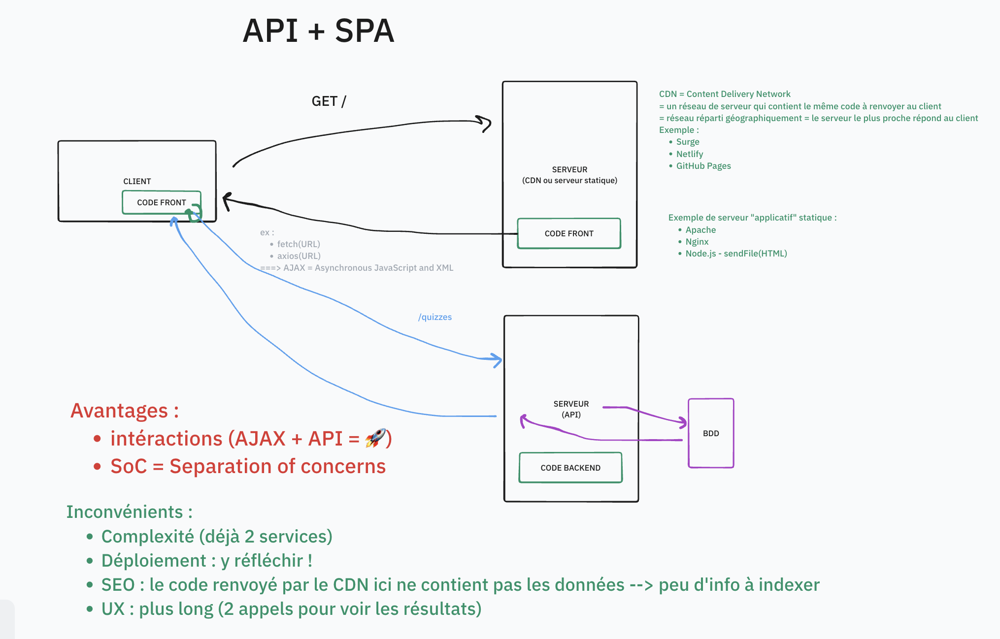
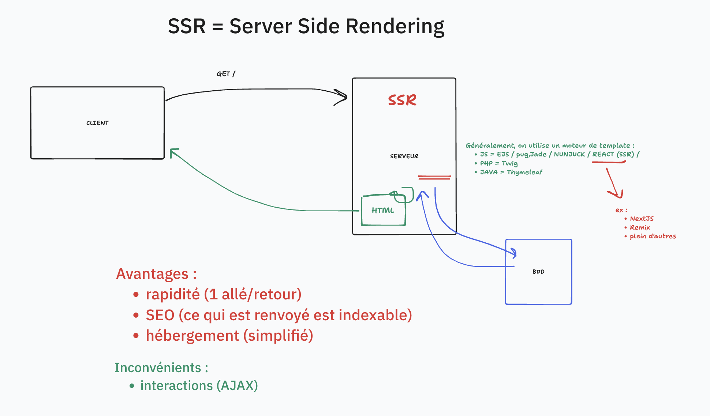

# SC01E01 - Gestion de projet et modélisation UML

## Menu du jour 

- Présentations (30min)
  - Brise glace
  - Bloc C
  - Titre Pro
  - Menu du jour

- Gestion de projet (2H)
  - Demande client (vidéo)
  - Clarification du besoin
  - Récits utilisateurs (`user stories`)

- Modélisation UML (2H)
  - Outillage PlantUML
  - Différents diagrammes
  - Diagramme : cas d'utilisation

- Challenge
  - Analyse d'un besoin
  - User stories
  - Diagramme cas d'utilisation

## Demande client 

Que prévoir ? 
- Budget
- Cahier des Charges
- Ressources humaines & chiffrage du projet
- Architecture de solution
- **Comprendre le besoin et en déduire la liste des fonctionnalités attendues**
  - Spécification de l'application
- Notions 
  - Plateforme cible (Mobile, Desktop, Responsive)
- Web Design 
  - UI/UX
  - Maquettes et prototymes
- Organisation
  - Agiles
  - Kanban
  - Roadmap
  - Retro-planning
- Déploiement, dimensionnement de l'hébergement (scalabilité) et maintenance et monitoring
- Sécurité
- Tests
- SEO
- Données fournies

## Anecdote

Différence :
- **Web** = World Wide Web = l'ensemble des ressources accessibles en HTTP sur internet
- **Internet** = réseau physique, l'infrastructure (cables, antenne, protocoles)

Culture G : **Internet est l'infrastructure du Web**

Exemple de protocole internet : FTP (transfert de fichier) / SSH (connexion à une machine) / IRC (Internet Relay Chat) / IMAP POP (email)

## Architecture

## Vobulaire

Rédaction pour les semaines à venir : 
- 🇫🇷 Français : 
  - `un quiz`
  - `des quiz`
- 🇺🇸 Anglais : 
  - `one quiz`
  - `many quizzes`

## UML 

Unified Modeling Language = Language graphique pour modéliser un système (ou parties d'un système)

Divers graphiques à dispositions (séquences, classes, entité-relations) : objectif clarifier le besoin et se faire comprendre.

Communiquer avec les collègues.

Il existe plusieurs languages pour générer les graphiques (PlanUML, Mermaid) -> ce qui importe, c'est le grpahique, pas le code.