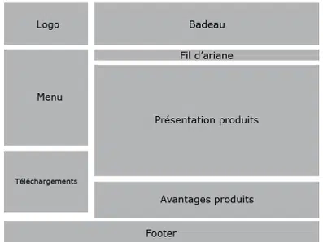
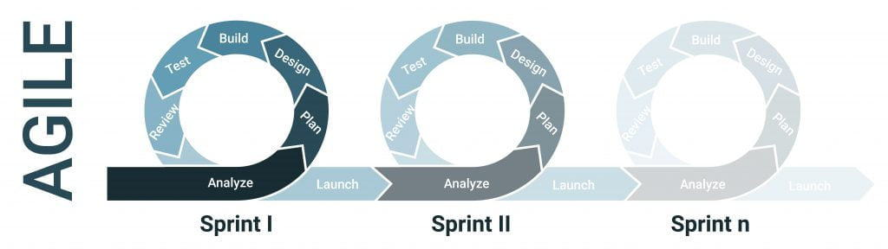
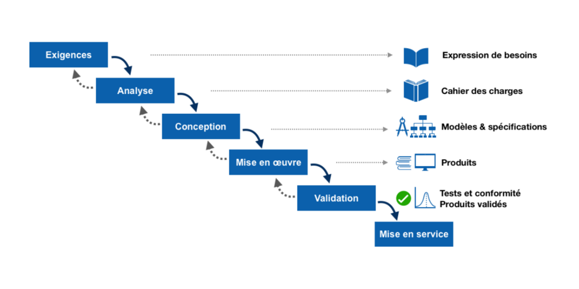

# SC01E02 - Web Design

## Menu du jour 

- O'vitrine (correction commentée)
  - "Des questions sans réponse ?"
  - Récits utilisateurs
  - Diagramme cas d'utilisation (UML)
    - o'vitrine
  - Diagramme de séquence
    - Sessions

- Web Design
  - Zoning
  - Wireframes
  - Mockups
  - Prototype

- Gestion de projet
  - Agile ou Waterfall
  - Outils agiles (Kanban)
  - Diagramme de séquence

- Challenge
  - Gitflow
  - Web design
  - Diagramme de séquence

## Sites web pour l'inspiration en web Design 

- https://www.awwwards.com/
- https://www.landingfolio.com/
- https://dribbble.com/
- https://www.behance.net/ (Adobe)

## Pull Request

- Créer une branche : 
  - `git checkout -b BRANCHE`

- Push la branche : 
  - `git push`
  - `git push --set-upstream origin BRANCHE` (la première fois)

- Créer une Pull Request (GitHub)
  - attention au sens
  - `main` <-- `BRANCHE`

- Merge Pull Request (Github)
  - bouton `Merge`

- Mettre à jour `main` en local
  - penser à fermer vos onglets (ça va switcher)
  - `git checkout main`
  - `git pull`

## Web Design 

- A l'aide d'un outil :
  - TLDraw
  - Whimsical
  - Figma

- Wireframes de la home page (version Desktop et/ou mobile)

- Une fois terminé, rejoindre le Canal **Slack** `cockpit-bloc-c`
  - et poster en Thread de mon message votre/vos wireframes ! 

- Objectif : le formateur corrige pour vous éviter de refaire les erreurs dans le futur ! 

Oquiz : 
- Page "vitrine" (landing page) : 
  - présente le fonctionnement de l'app
  - illustration
  - screenshot
  - mais de vrai quizzes qui s'affiches (rien de la BDD)
  - lien vers l'app (home page de l'app)

- Page "accueil" (home - app)
  - présence quelques quizzes (plus récents ?)
  - pour donner envi
  - liens pour les différentes fonctionnalités

Wireframes : page d'accueil

### Recap 

| Zoning                                | Wireframes                               | Mockup                               |
| ------------------------------------- | ---------------------------------------- | ------------------------------------ |
|  |  |  |

## Conseil Titre Pro

L'objectif est de montrer que l'on connait la démarche de design ui/ux : 
- zoning
- wireframes
- mockup
- prototype

Donc, le plus simple, c'est de présenter l'ensemble de ces documents pour UNE fonctionnalités, dans son ensemble : 
- penser à faire des wireframes versions mobiles (responsive)
- penser aux différents rôles

## Librairies CSS (ou de composants) qui proposent des design systems

- Bootstrap
- Bulma
- Shadcn (particulièrement customizable)
- Tailwind
- Ant Design
- Materialize
- Material UI (MUI)
- Mantine
- et la liste est longue ! 

- Pico 🔥 (parfait pour prototyper car pas de classe à écrire)

## Ressource complémentaire pour l'inspiration

- Landing pages : https://www.landingfolio.com/
- Landing pages : https://www.webdesign-inspiration.com/
- Composants / UI Snippets : https://uiverse.io/
- Composants / UI Snippets : https://freefrontend.com/
- Codepen / UI Snippets : https://codepen.io
- Awards : https://thefwa.com/about/about-fwa/
- Couleurs : https://coolors.co/
- Couleurs : https://colorhunt.co/
- Couleurs : https://color.adobe.com/fr/trends

## Agile vs Cycle en V

| Agile                               | Cycle V                               | Cascade                               |
| ----------------------------------- | ------------------------------------- | ------------------------------------- |
|  |  |  |
