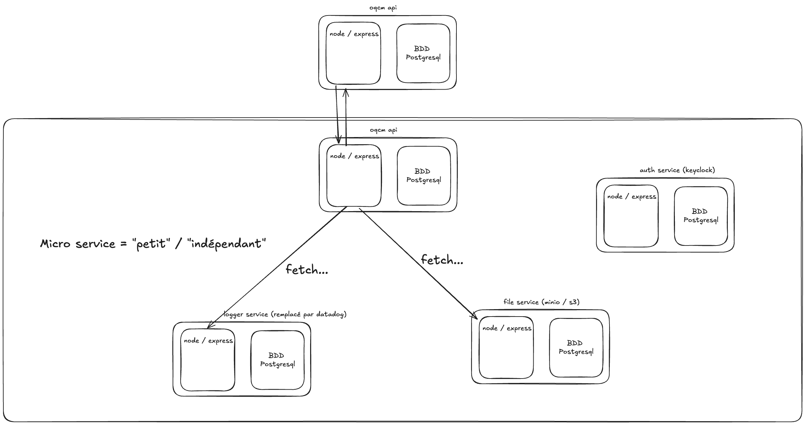

# SC04E01 - Logger & microservice

## Objectif du logger

- Traçabilité des actions => savoir qui a fait quoi, quand, où
- Débogage des erreurs => comprendre ce qui s'est passé en cas de problème
  - Que ce soit en production ou en développement
- Analyse des performances => identifier les goulets d'étranglement, les requêtes lentes
  - Si ma requête prend 10 secondes, pourquoi ?
- Analyse de l'activité des utilisateurs => comprendre comment les utilisateurs interagissent avec l'application
  - Quelles sont les pages les plus visitées ?
  - Quels sont les parcours utilisateurs ?

## En pratique

Ça pourrait se résumer à un `console.log`. Mais dans la pratique on va privilégier des outils de logging qui vont nous permettre de :
- Structurer les logs
- Les envoyer vers un système de stockage centralisé (fichier de log / base de données / service externe)
- Pouvoir personnaliser les logs en fonction de leur destination


## Winston

Winston va nous permettre de faire nos logs de manière structurée et personnalisée.

- `npm install winston`
- On va se créer un fichier `lib/log.ts` pour centraliser notre logger

```typescript
import { createLogger, format, transports } from 'winston';

const logger = createLogger({
  // On définit le niveau de log par défaut (il affichera les logs de ce niveau et au-dessus)
  level: 'info',
  // On définit un format de log, ici en JSON avec un timestamp
  // Le Timestamp EST VRAIMENT TRES IMPORTANT pour la traçabilité
  // Sans timestamp, le log est inutilisable
  format: format.combine(
    format.timestamp(),
    format.json()
  ),
  // Les transports sont les destinations des logs
  // Chaque transport peut être configuré pour un niveau de log spécifique / un format spécifique
  transports: [
    // On peut envoyer les logs vers la console
    new transports.Console(),
    // On peut aussi les envoyer vers un fichier
    new transports.File({ filename: 'error.log', level: 'error' }),
    new transports.File({ filename: 'combined.log' })
  ]
});

export default logger;
```

Utilisation

```typescript
import logger from './lib/log.js';

// Exemple de log d'information
logger.info('This is an info log', { additionalData: 'value' });
// Exemple de log d'erreur
try {
  throw new Error('This is an error');
} catch (error) {
  logger.error('An error occurred', { error: error.message });
}
```

## Morgan

Morgan est un middleware pour Express qui va nous permettre de récupérer les informations des requêtes HTTP et de les transmettre à notre logger.

- Le temps de réponse
- Le code de statut HTTP
- L'URL / méthode de la requête

Puis ensuite, on envoie les logs vers notre logger.

```typescript
// api/src/middlewares/logger.middleware.ts
import morgan from 'morgan';
import { logger } from '../lib/log.js';

export const loggerMiddleware = morgan(
  // tokens est un objet contenant les informations générées par Morgan tel que le temps de réponse, le code de statut HTTP, l'URL et la méthode de la requête
  function (tokens, req, res) {
    return JSON.stringify({
      method: tokens.method(req, res),
      url: tokens.url(req, res),
      status: Number.parseFloat(tokens.status(req, res) || '0'),
      content_length: tokens.res(req, res, 'content-length'),
      response_time: Number.parseFloat(tokens['response-time'](req, res) || '0'),
    });
  },
  {
    stream: {
      // On transmet les logs à Winston
      write: (message) => {
        const data = JSON.parse(message);
        logger.http(`incoming-request`, data);
      },
    },
  }
);
```

```typescript
// api/src/app.ts
// ... 
import { loggerMiddleware } from './middlewares/logger.middleware.js';
// ...

app.use(loggerMiddleware);

app.use(router);

// ...
```


## Microservice

Un microservice est une architecture logicielle (moyen de s'organiser) qui consiste à décomposer une application en petits services indépendants, chacun responsable d'**une** fonctionnalité spécifique. Chaque microservice peut être développé, déployé et mis à l'échelle **indépendamment** des autres.


