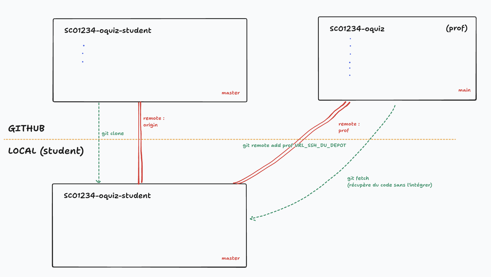

# Gitflow

Idée : 
- Accepter le `ochallenge` le premier jour, puis cloner son propre dépôt généré.
- À partir du deuxième jour, et jusqu'à la fin du projet, mettre à jour chaque jour son dépôt à partir du code "prof" avant d'entamer l'atelier.
- Coder chaque challenge sur une branche dédiée, afin de créer des Pull Request et se (faire) relire facilement.

## 1. Ouvrir votre dépôt

- Ouvrir **votre dépôt** dans VSCode (pas celui du prof) avec un terminal à disposition.
- Fermer éventuellement les onglets ouverts (ça va switcher chéri !).

## 2. (A FAIRE UNE SEULE FOIS) Ajouter le remote du prof

A faire **une seul fois pour la saison**, ajouter le remote `prof` :
- Trouver l'URL (SSH !) du dépôt du/de la formatrice (correction/cours) via GitHub ou Kourou.
- Puis, depuis n'importe quelle branche : ✅ `git remote add prof URL_SSH_DEPOT_PROF` 

## 3. Retourner sur `master`

On s'assure d'avoir bien sauvegardé le code de la veille :

- Si vous êtes déjà sur une branche :
  - le `git status` doit être "clean", sinon `commit` & `push` comme d'habitude ;
  - puis retourner sur `master` : `git checkout master`.

- Si vous aviez codé directement sur `master` (par inadvertance, bien sûr 😉) :
  - le `git status` doit être "clean", sinon `commit` & `push` comme d'habitude ;
  - sauvegarder votre travail sur une branche à part : 
    - `git checkout -b <mabranche>` puis `git push --set-upstream origin <mabranche>` ;
  - puis retourner ensuite sur `master` : `git checkout master`.
  

## 4. Récupérer les modifications du prof sur `master`

- S'assurer d'être bien sur la branche `master` :
  - `git branch --show-current`
- Récupèrer le code du prof en local, sans l'intégrer à la branche courante :
  - ✅ `git fetch prof`
- Enfin, on écrase la branche courante (`master`) par la branche `main` du dépôt `prof` :
  - ✅ `git reset --hard prof/main`
- On push le code du prof sur Github sur notre branche `master`
  - ✅ `git push --force`
  
## 4. Créer une nouvelle branche pour un nouveau challenge

Normalement, vous devriez maintenant avoir le code du prof sur votre branche `master` en local !

Il ne reste plus qu'à créer une nouvelle branche pour l'atelier de la journée : 
- `git checkout -b <manouvellebranche>` (choisir un nom adapté à la journée, à l'activité...)

## 5. Visuellement

